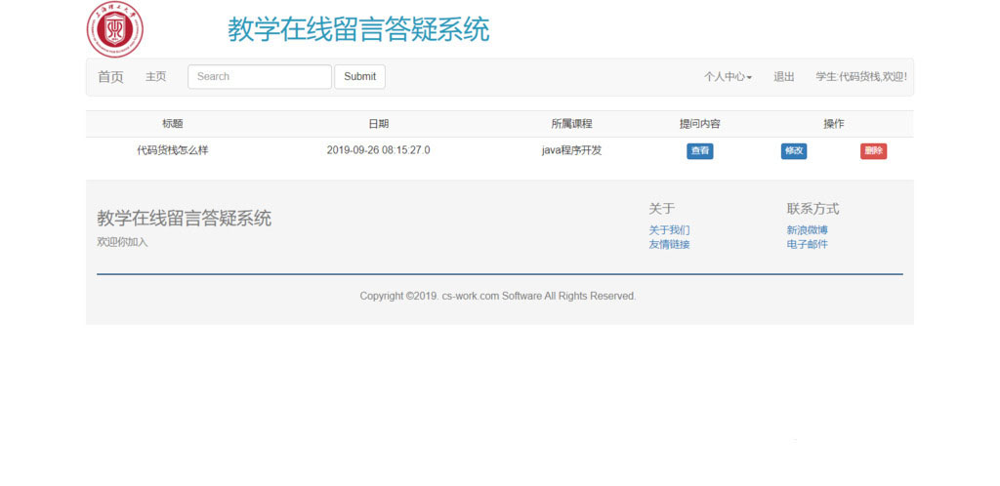
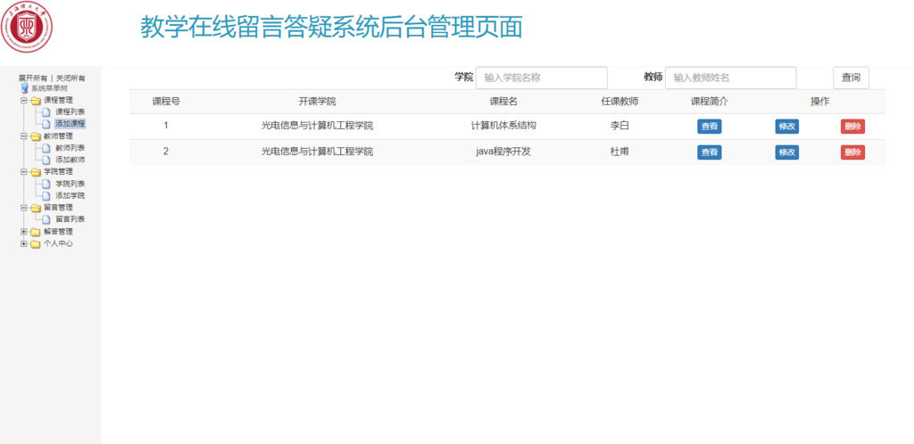
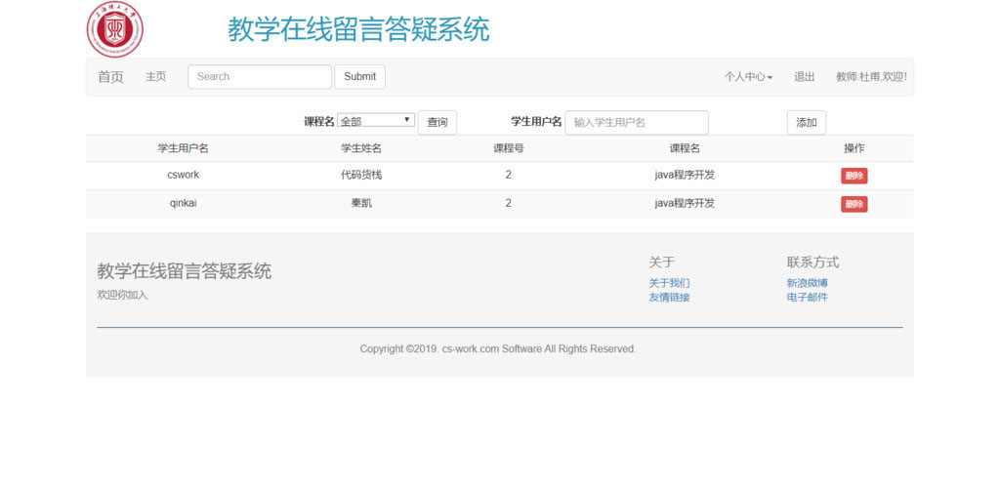
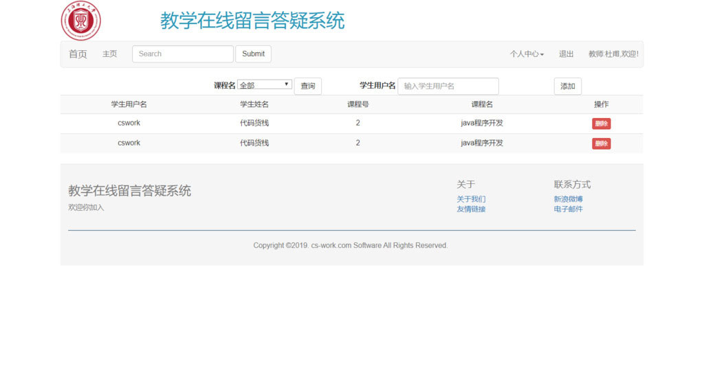

## 基于JSP+Servlet实现的在线教学答疑系统

- <b>完整代码获取地址：从戎源码网 ([https://armycodes.com/](https://armycodes.com/))</b>
- <b>技术探讨、资料分享，请加QQ群：692619798</b> 
- <b>作者微信：19941326836  QQ：952045282</b> 
- <b>承接计算机毕业设计、Java毕业设计、Python毕业设计、深度学习、机器学习</b>
- <b>选题+开题报告+任务书+程序定制+安装调试+论文+答辩ppt 一条龙服务</b>
- <b>所有选题地址 ([https://github.com/YuLin-Coder/AllProjectCatalog](https://github.com/YuLin-Coder/AllProjectCatalog)) </b>

## 项目介绍
基于JSP+Servlet实现的在线教学答疑系统，主要功能如下

【学生】
个人中心：我的提问，修改密码
1. 注册和登录：学生可以注册和登录自己的账号。
2. 查看课程：学生可以查看自己所选的课程列表。
3. 提问留言：学生可以向教师提问和留言，描述自己的问题和困惑，并选择合适的课程进行提问。
4. 查看留言回复：学生可以查看教师对自己提问的回复，了解问题的解答和解决方案。

【老师】
个人中心：我的回答，修改密码
1. 注册和登录：教师可以注册和登录自己的账号。
2. 查看所授课程：教师可以查看自己所授课程的列表。
3. 回答留言：教师可以回答学生的提问和留言，提供问题的解答和解决方案。
4. 查看学生留言：教师可以查看学生的提问和留言，了解学生的问题和困惑。
5. 修改个人信息：教师可以修改自己的个人信息，如用户名、密码、联系方式等。

【管理员】
课程管理：课程列表，添加课程
教师管理：教师列表，添加教师
学院管理：学院列表，添加学院
留言管理：留言列表
解答管理：解答列表
个人中心：修改密码，退出

## 项目技术
- 编程语言：Java
- 数据库：MySQL
- 前端技术：JSP、JavaScript、bootstrap、JQuery
- 后端技术：Servlet、JDBC

## 运行环境
- JDK版本：JDK1.8及以上
- 开发工具：IDEA、Ecplise、Myecplise都可以
- 数据库: MySQL5.7及以上

## 运行截图

